# 基于Springboot的在线拍卖系统

## Springboot-0001


## 技术栈

Springboot mybatisplus vue mysql maven


## 数据库表(10张)


## 功能介绍

```properties
管理员
首页、个人中心、用户管理、商品类型管理、拍卖商品管理、历史竞拍管理、竞拍订单管理、留言板管理、系统管理，用户；首页、个人中心、历史竞拍管理、竞拍订单管理、留言板管理，前台首页；首页、拍卖商品、竞拍公告、留言反馈、个人中心、后台管理模块的修改和维护操作。
```


## 图片

### 前台


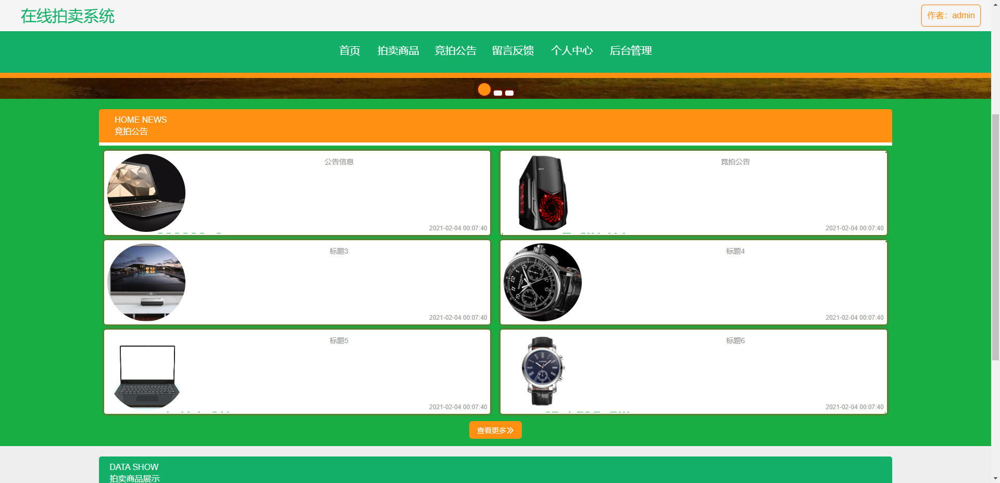


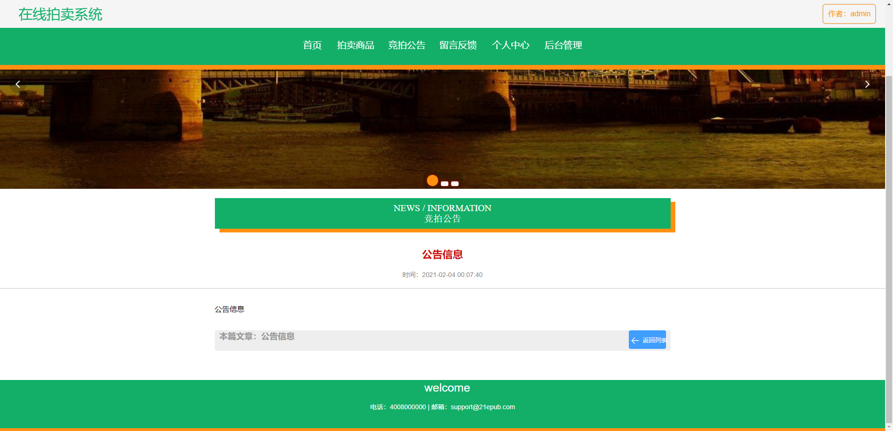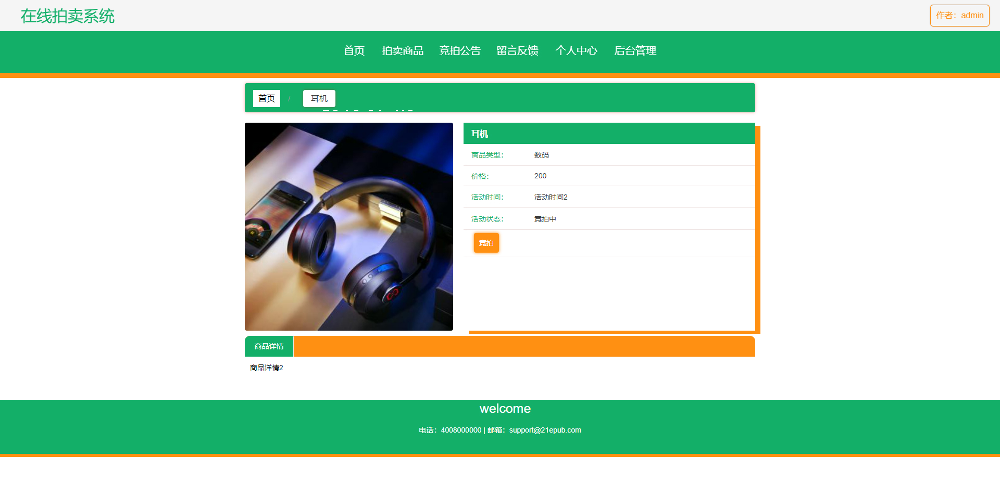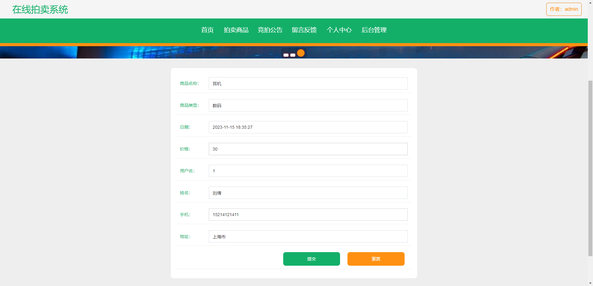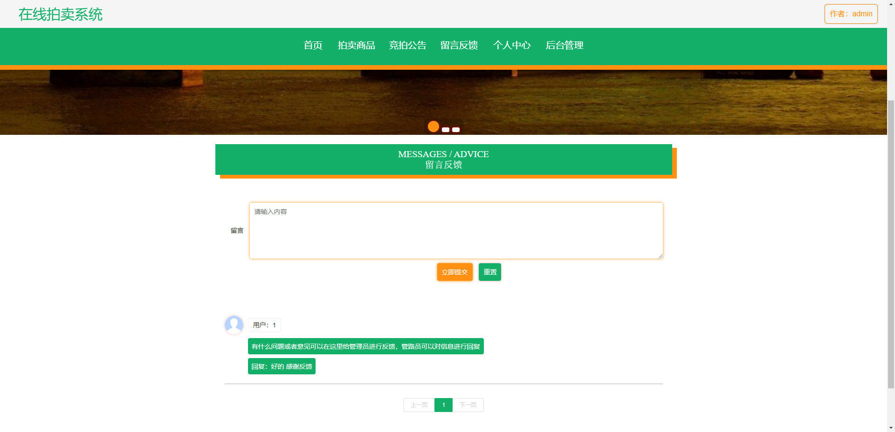

### 后台


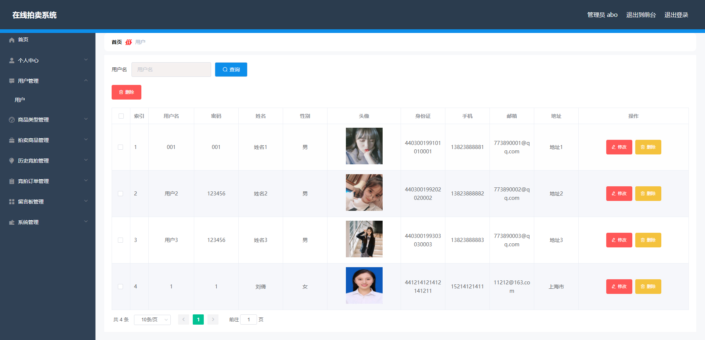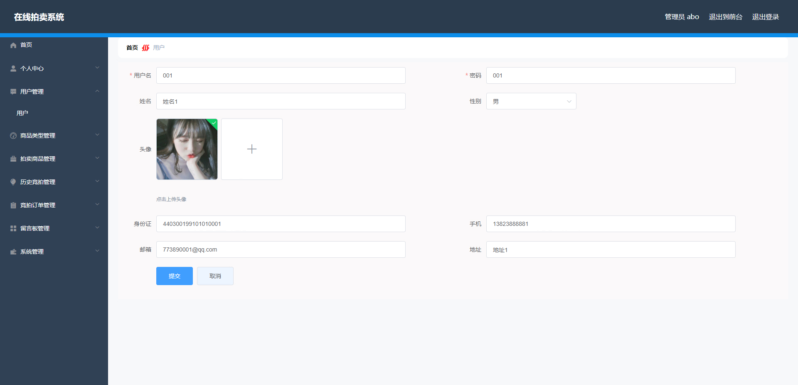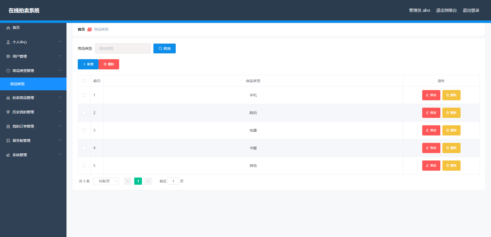

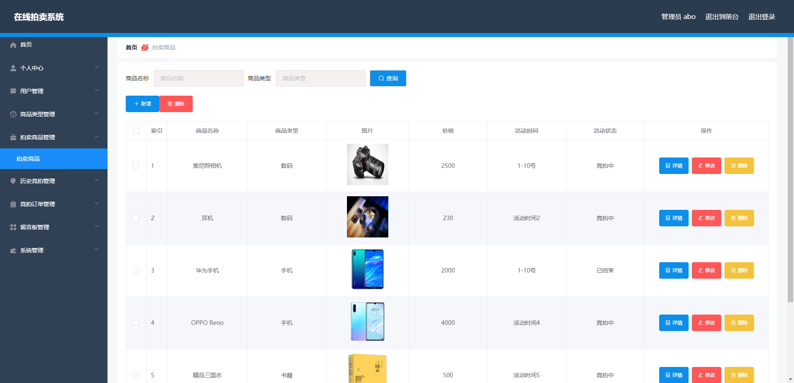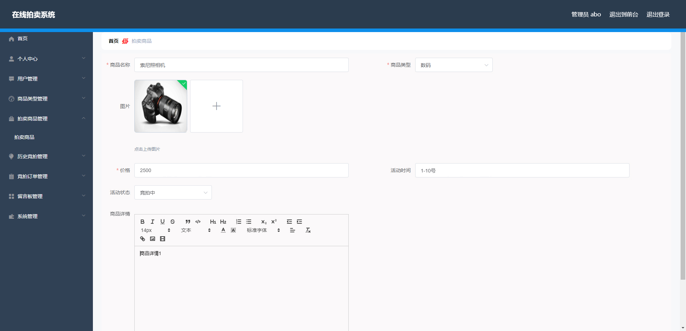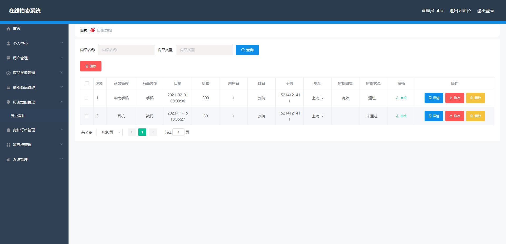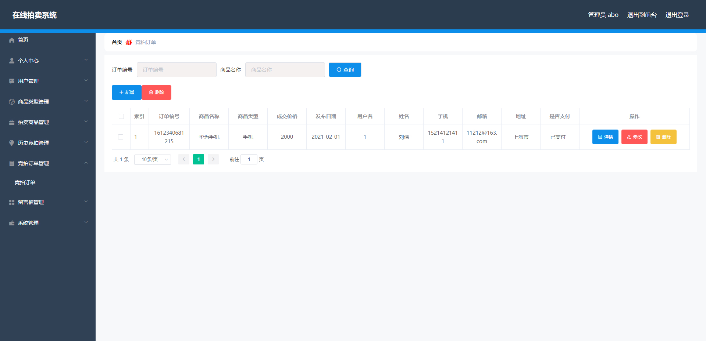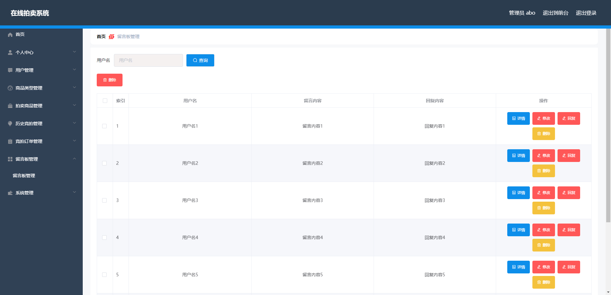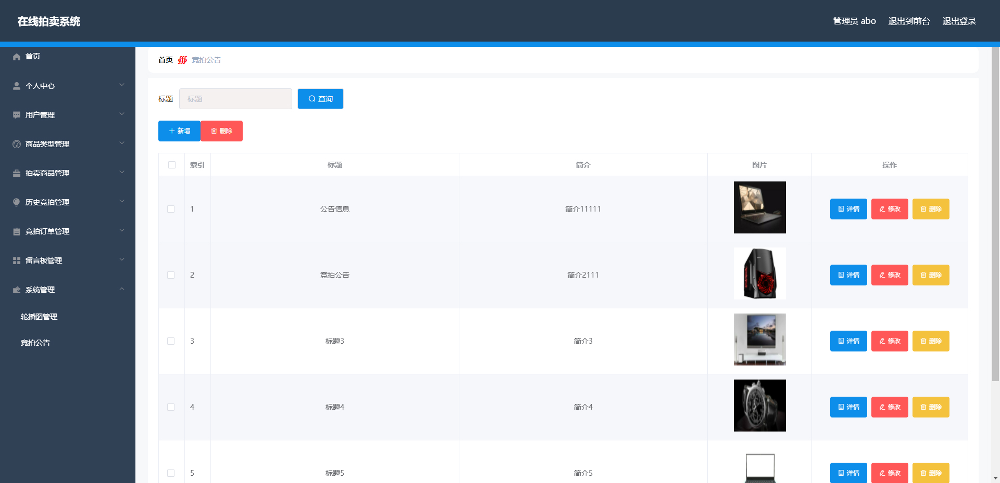

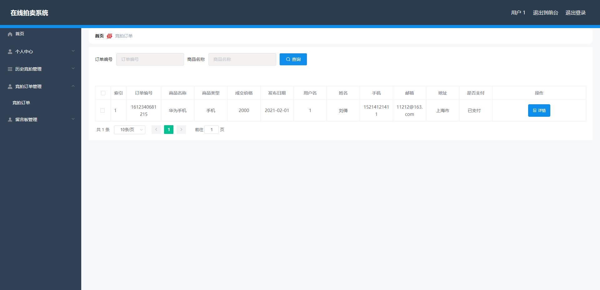

## 访问路径

### 前台

```properties
http://localhost:8080/springbootp0eo6/front/index.html

账号 a1
密码 123456
```

### 后台

```properties
http://localhost:8080/springbootp0eo6/admin/dist/index.html#/login

账号 admin
密码 admin
```


## 功能图

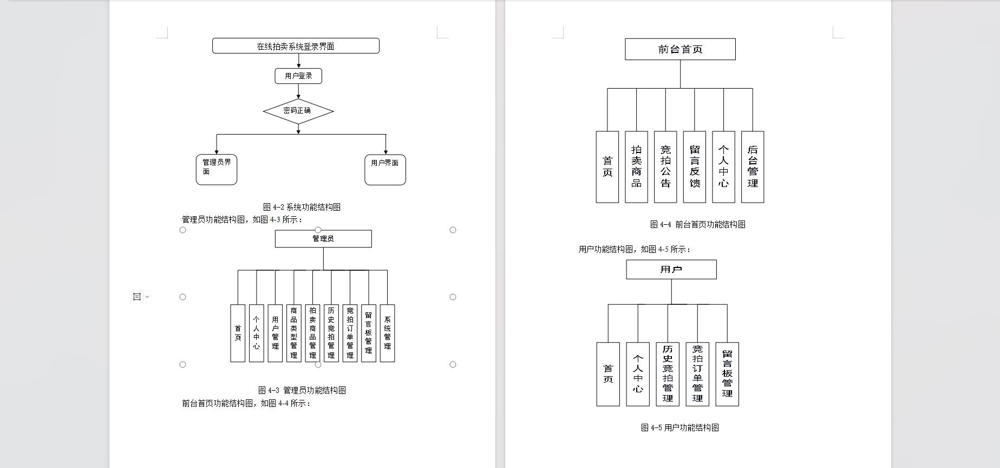


## 文档目录

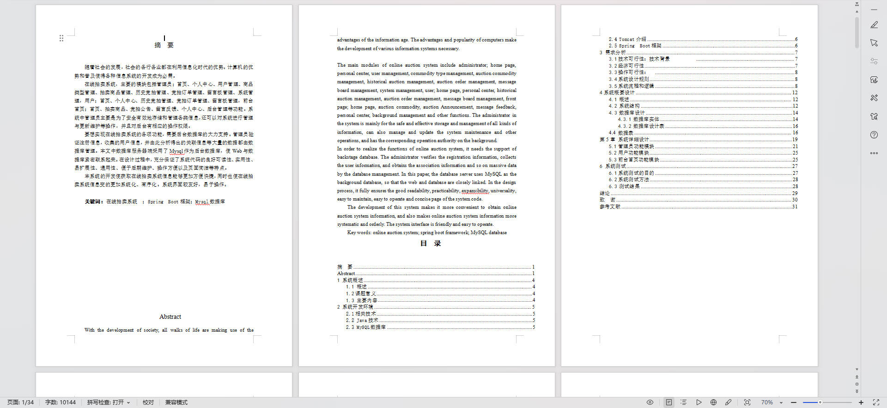


## 打赏或交流


